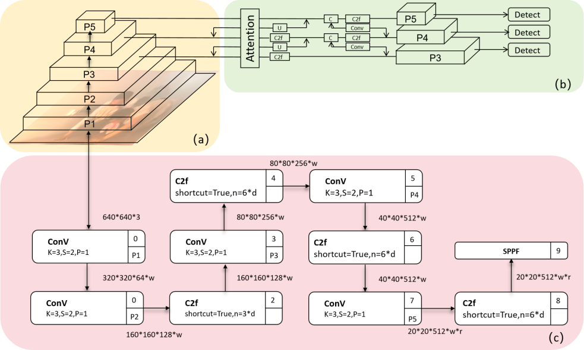

# Venue Crowd Recognition in Dense Smoke Environment: A Recognition Method Based on Attention Mechanism Fusion Segmentation Instances


## Abstract:

In densely populated regions, the identification of evacuating pedestrians remains a significant challenge, with profound implications for disaster management and public safety. Here, we present a novel approach to identifying evacuating pedestrians under such challenging conditions. Our method integrates attention mechanisms with segmentation techniques to accurately identify individuals amidst the dense smoke and haze of fires. Through extensive experimentation and validation, we demonstrate the robustness and effectiveness of our approach in real-world scenarios. This study not only advances the field of pedestrian recognition but also provides valuable insights for improving emergency response strategies in fire-affected areas. We propose a computer vision approach by augmenting target pedestrian recognition with a Mask branch on top of object detection algorithms, utilizing channel attention mechanisms to enhance target pedestrians in the environment while reducing the weighting of the environment in images. We introduce a YOLOv8-Mask model which effectively enhances pedestrian recognition in hazy scenes typical of fire-smoke environments, facilitating efficient rescue operations for trapped individuals. Finally, comparative experiments conducted on self-collected datasets with five established object detection models demonstrate the superiority, robustness, and effectiveness of our proposed model in crowd recognition under such hazy conditions and real-world scenarios. The research outcomes presented herein contribute to assisting rescue efforts in densely populated venues amidst fire-smoke conditions, thereby providing technological support for the development of resilient cities.

### The specific structure of the model

The specific structure of the model is shown in the following figure:



## Preparation work

If you want to use our model, you need to use it in the Yolov8 environment, so it is necessary for you to install the Ultratics environment in your work environment in order to run our model.
Ultratics is a very powerful project that is the foundation for running the YOLOv8 model. Its download link is: https://github.com/ultralytics/ultralytics In this link, you will be able to download UltraAnalytics

## Used

In the use of the model, we have placed the files required for the installation environment in the root directory. By running the following code on the terminal, we can easily install the environment required for the model to run
When installing the environment, you need to enter the following code in the terminal

```bash
pip install -r requirements.txt
```

```bash
pip install ultralytics
```

```bash
pip install yolo
```
After the installation is completed in the external environment, you need to run the setup file

```bash
python setup.py
```

When everything is ready, we can start running our model. We have prepared a dataset in advance, which includes five images. To test it, you can input:

```bash
yolo predict model=YOLOv8-Mask.pt source=huozai
```

If you want to train your dataset, you need to modify this command by entering:

```bash
yolo predict model=YOLOv8-Mask.pt source=‘The folder path where your test set is located’
```
